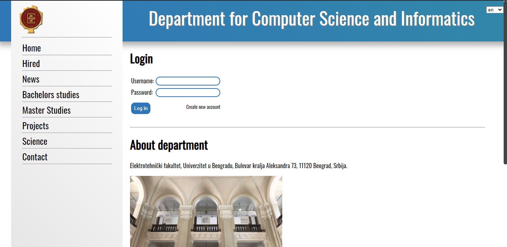
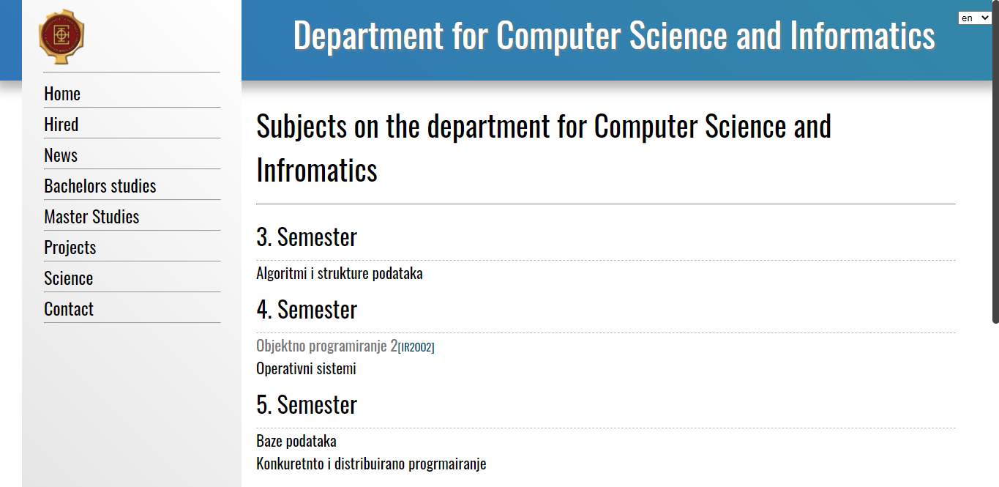
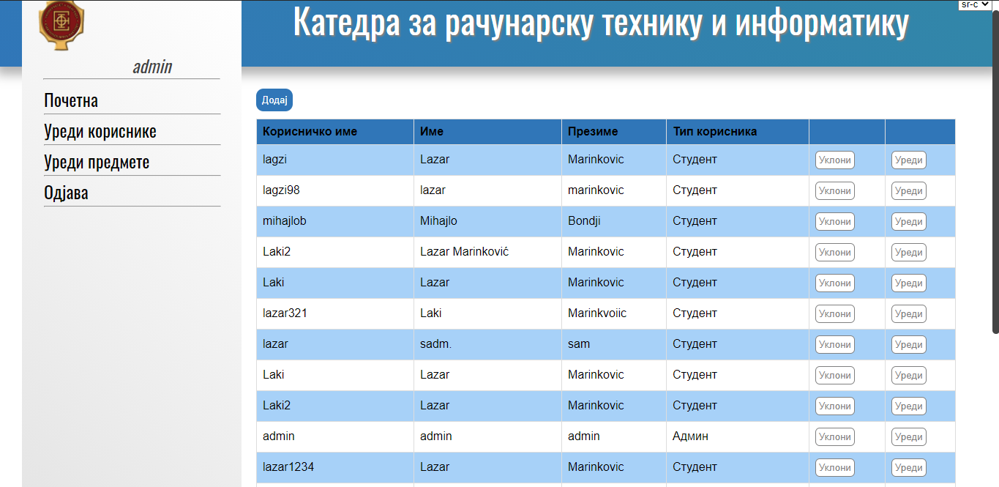

# estudent
 
Web application for students and professors. **(Angular, NodeJS, MongoDB)**

There is a login page on which the user can log in or choose to register which will redirect them to the register page.
The user can change the language in the right-upper corner (English, Serbian Latin, Serbian Cyrillic)
All pages are dynamic and connected to the MongoDB database.

Types of users:
 - Registered
   - Student
   - Professor
   - Admin
 - Unregistered

### Unregistered user

- Can see a list of professors and which subjects they are teaching
- Can see the dynamic page of any professor about their information
- Can see a list of all the subjects, grouped by department and semesters
- Can see a list of master studies subjects
- Can see the Contact tab with a list of professors and their contact details
- Can see News, posts, students' competitions, jobs, and internship news

### Registered User

#### Student

- Can see the news that professors posted recently (in the recent 3 months, older ones are archived)
- Can see a list of subjects that they attend
- Can see information about subjects that they attend, add themselves to the list of labs/tests/exams, and upload their homework
- other tabs are the same as an unregistered user

#### Professor

- Can see the list of the subjects that they teach
- Can open information about those subjects and edit them
- Can write news post related to the subjects that they teach
- Can open a list for lab/exam/homework on which students can upload their works
- Can upload materials for the subjects that they teach (pdf books, exam results, etc.) which are available to the students

#### Admin
- Can see the list of all users, add new user, delete user, edit user
- Can load new users from .csv file
- Can see the list of all subjects, add a new subject, remove subject, edit the subject
- Can add subject to the professors' subjects list or students' subjects list
- Can edit all the news post

